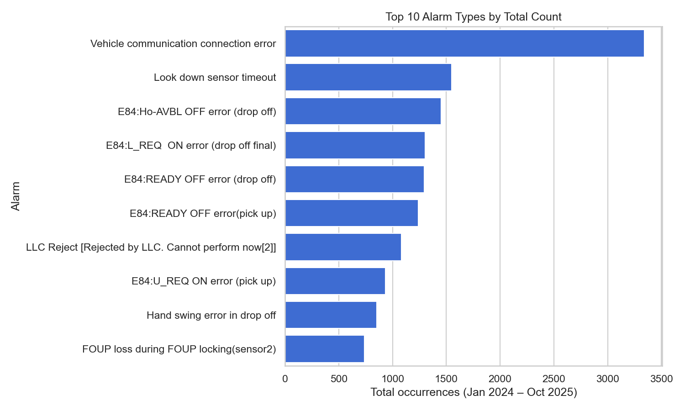
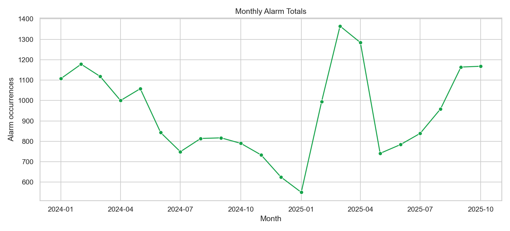
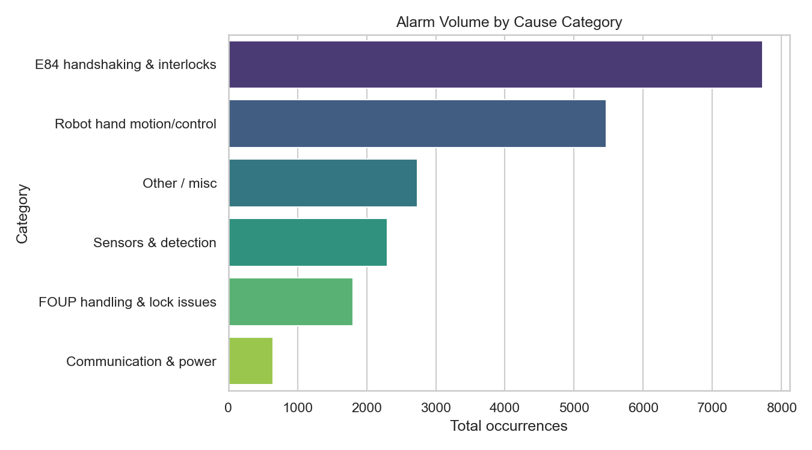

# Infineon Alarm Insights

Spreadsheet: https://docs.google.com/spreadsheets/d/1O8UruRR699hr3tVptBUAWpTgLGBYBw9eo67oGErP5Wo/edit?usp=sharing

This repository captures the analysis of the `infineon.xlsx` workbook, focusing on the `AlarmData` sheet. Each record represents the number of times a specific alarm fired in a given month between **Jan 2024 and Oct 2025**.

## Overview

- **Observation window:** Jan 2024 – Oct 2025 (22 months, 476 month–alarm combinations).
- **Alarm volume:** 20,681 occurrences; the top 10 alarm messages alone contribute **66.7 %** of all hits.
- **Volatility:** Monthly totals swing from just **550** alarms (Jan 2025) to **1,365** (Mar 2025).
- **Artifacts:** Charts live in `charts/` and the aggregated metrics are stored in `analysis/summary.json`.

## Top-Alarms Snapshot

| Rank | Alarm ID | Alarm text | Count | Share |
| --- | --- | --- | ---: | ---: |
| 1 | 851110 | Vehicle communication connection error | 3,341 | 16.2 % |
| 2 | 854524 | Look down sensor timeout | 1,549 | 7.5 % |
| 3 | 854690 | E84:Ho-AVBL OFF error (drop off) | 1,454 | 7.0 % |
| 4 | 854692 | E84:L_REQ ON error (drop off final) | 1,305 | 6.3 % |
| 5 | 854693 | E84:READY OFF error (drop off) | 1,297 | 6.3 % |
| 6 | 854677 | E84:READY OFF error (pick up) | 1,242 | 6.0 % |
| 7 | 900009 | LLC Reject \[Rejected by LLC. Cannot perform now\] | 1,083 | 5.2 % |
| 8 | 854676 | E84:U_REQ ON error (pick up) | 934 | 4.5 % |
| 9 | 854123 | Hand swing error in drop off | 853 | 4.1 % |
| 10 | 855263 | FOUP loss during FOUP locking (sensor2) | 739 | 3.6 % |

Six of the top ten alarms are E84 handshaking failures, highlighting a persistent drop-off/pick-up timing problem between the OHT and the tool interface.

## Root Causes (Categorized)

| Cause bucket | Count | Share | Typical alarms |
| --- | ---: | ---: | --- |
| E84 handshaking & interlocks | 7,731 | 37.4 % | READY/OFF, L_REQ, U_REQ, Ho-AVBL faults |
| Robot hand motion/control | 5,464 | 26.4 % | Hand swing errors, positioning speed faults |
| Other / misc | 2,734 | 13.2 % | LLC rejects, query exceptions |
| Sensors & detection | 2,298 | 11.1 % | Look-down sensor timeout, sag detection |
| FOUP handling & lock issues | 1,807 | 8.7 % | FOUP loss during locking, flange ON/OFF |
| Communication & power | 647 | 3.1 % | Vehicle communication and voltage drops |

E84 protocol timing still drives more than a third of all alarms, but the “Other / misc” bucket has expanded quickly in 2025 due to newly surfacing LLC rejects.

## Charts







## Additional Interesting Insights

- **Volume dip then surge:** H1 2024 logged 6,304 alarms, but H2 2024 dropped 28 % to 4,528 before rebounding to **9,849 alarms in the first ten months of 2025**.
- **New LLC gatekeeping behavior:** Alarm `900009 (LLC Reject)` first appears in Feb 2025 yet already contributes **5.2 %** of all alarms; it spiked to **420 hits in Apr 2025**, pointing to a new automation safeguard throttling moves.
- **Communication instability:** `Vehicle communication connection error (851110)` doubled from **149 events in Jan 2024** to **309 in Oct 2025**, even while other E84 errors eased—implying the transport network rather than the handshake itself is degrading.
- **Sensor improvements:** `Look down sensor timeout (854524)` fell from 86 (Jan 2024) to 62 (Oct 2025), and the overall Sensors & Detection share shrank from **14.3 % in 1H24 to 8.6 % in 2025**, suggesting calibration work paid off.
- **Diversity whiplash:** Unique alarms per month collapsed to just **15** in Dec 2024 but bounced back to **25** by Mar 2025, showing how quickly issue mix can shift as new failure modes (LLC rejects) emerge.
- **Concentrated spikes:** The three busiest months (Feb–Apr 2025) alone generate **18.5 %** of all 20,681 alarms, so remediation efforts targeted at those surges could yield outsized returns.

## “English” Sheet Insights

- **Coverage & structure:** 946 controller-level error codes span IDs 1110–9992. Types map cleanly to severity classes—`E` (errors, 63.8 %) are always `Level 3 / Class 2`, `W` (warnings, 35.3 %) are `Level 1 / Class 6`, and `C` (critical, 0.8 %) are `Level 5 / Class 7`. This provides a turnkey severity taxonomy for alert routing.
- **Operational problem statements:**
  - **Unlinked vocabularies:** None of the 58 six-digit `Alarm_ID`s in `AlarmData` appear in this four-digit dictionary, so analysts cannot yet pull severity/type metadata into the volume trends. Building an OHT→equipment-code crosswalk is the single biggest blocker to richer insights.
  - **Runbook blind spots:** 73 codes (7.7 %) lack “Item to be confirmed” checklists; the 2300-series BCU/modem family alone is missing guidance 75 % of the time, leaving comms incidents under-specified for operators.
  - **Concentrated failure surface:** Just five hundred-block families (4600, 2400, 2900, 2300, 2800) contain 322 codes—**34 % of the dictionary**—and all map to material-flow setup, auto-lifter interlocks, SCPS drive health, and modem links. These are the subsystems most likely to produce unfamiliar alarms in the field.
- **Leveraging the sheet to solve things:**
  - **Automate escalation:** Use the Type/Level/Class triad to drive paging (auto-page for `C` Level 5 codes, open tickets for `E`, suppress/auto-retry `W` up to their defined retry count). Because 99 % of `E` codes disallow retries while warnings own every multi-retry case (46 allow one retry, 11 allow two), this strategy aligns perfectly with engineering intent.
  - **Improve warning handling:** `W` entries supply “Item to be confirmed” only 81 % of the time versus 99 % for `E`. Prioritizing checklist authoring for warning-heavy families (2300 modems, 1400 interlocks, 2900 power) would close the human-factors gap without touching tooling.
  - **Subsystem playbooks:** The dominant families naturally cluster: 4600 codes highlight destination/order database drift, 2400s point to RTM/auto-lifter permissions, 2900/2800s scream drive temperature/overcurrent. Grouping monitoring/maintenance efforts by these families ensures coverage of one-third of the catalog with a handful of targeted runbooks.
  - **Predictive filtering:** Because retry allowances sit almost exclusively in warnings, a simple rule of “only surface a warning after the allowed retry budget is exhausted” can cut console noise without risking missed critical events.
- **Next steps:** build the translation layer, enrich AlarmData with Type/Level/Retry from this sheet, and feed the combined set into the existing chart pipeline to spotlight which production alarms deserve automatic escalations versus auto-retries.

## Reproducing the Analysis

```bash
cd /Users/pushpit/Desktop/yeti/sem2/infineon-analysis
python3 -m venv .venv && source .venv/bin/activate
python -m pip install --trusted-host pypi.org --trusted-host files.pythonhosted.org pandas seaborn matplotlib openpyxl
python scripts/analyze_alarms.py
```

The script regenerates:

- `analysis/summary.json` – structured metrics used in this README.
- `charts/top_alarms.png`, `charts/monthly_totals.png`, `charts/category_totals.png` – ready to embed elsewhere.

Feel free to tweak `scripts/analyze_alarms.py` to add new slices (e.g., per-tool comparisons or quarterly aggregations). The categorization helper is keyword-driven, so expanding it with better taxonomy will immediately refine the “top causes” section.

